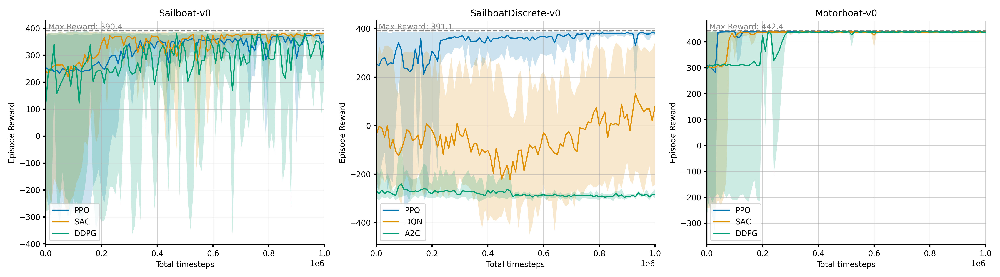

# gym-sailing

---

This is a Gymnasium (OpenAI Gym) environment designed to train reinforcement learning (RL) agents to control a sailboat. The environment simulates the dynamics of a sailboat and allows the agent to learn tacking behavior to reach a target point.


## Envs

- **Sailboat-v0**: The main environment with a continuous action space.
- **SailboatDiscrete-v0**: A variation of the environment with a discrete action space.
- **Motorboat-v0**: A easy test environment with a motorboat instead of a sailboat.

## Installation

You can install the latest release using pip by:

```bash
pip install gym-sailing
```

Or, if you know what you are doing you can clone and intall locally from the repository.

## Usage

### Basic Usage

Bare minimum code to run the environment:

```python
import gymnasium as gym
import gym_sailing

env = gym.make("Sailboat-v0", render_mode="human")
observation, info = env.reset(seed=42)

for _ in range(1000):
   action = env.action_space.sample()  # this is where you would insert your policy
   observation, reward, terminated, truncated, info = env.step(action)

   if terminated or truncated:
      observation, info = env.reset()

env.close()
```

### Training an RL Agent

To train an RL agent using stable-baselines3:

```python
from stable_baselines3 import PPO


# Initialize the agent
model = PPO('MlpPolicy', env, verbose=1)

# Train the agent
model.learn(total_timesteps=100000)

# Test the trained model
obs = env.reset()
for _ in range(1000):
    action, _states = model.predict(obs)
    obs, reward, done, info = env.step(action)
    env.render()
```

## Environment Details

### Observation Space

The observation space includes:

- **Boat Speed:** The current speed of the boat.
- **Boat Heading:** The angle of the boat relative to the wind, -$\pi$ to $\pi$.
- **Heading Rate:** The rate of change of the boat's heading.
- **Course to Target:** The angle between the boat's heading and the target, -$\pi$ to $\pi$.
- **Distance to Target:** The normalized distance between the boat and the target.

### Action Space

The action space consists of:

- **Rudder Angle:** The angle of the rudder, -1 to 1 for *Sailboat-v0*, *Motorboat-v0* and {-1, 0, 1} for *SailboatDiscrete-v0*.

### Reward

The default reward function includes:

- **Alive Penalty:** A penalty for each time step to encourage the agent to reach the target quickly.
- **Target Reward:** A reward for reaching the target.
- **Course Reward:** A penalty for leaving the course area.
- **Progress Reward:** A reward for making progress towards the target, using L8 norm, to encourage the agent to move upwind.

### Episode End

- The environment is **terminated** if the boat reaches the target or leaves the course area.
- The environment is **truncated** after 3000 steps.

## Benchmarks

Benchmarks using stable-baselines3 with default hyperparameters



## Contributing

Contributions are welcome, please fork the repository and submit a pull request with your changes. For any questions or suggestions, feel free to open an issue.

## Future Work

This is a list of features that I would like to add in the future:

- Add currents of different intensities and directions.
- Add wind shifts.
- Add wind gusts and lulls.
- Make the polar diagram more accurate, using the ones from this paper: *R. Binns, F. W. Bethwaite, and N. R. Saunders, “Development of A More Realistic Sailing Simulator,” High Performance Yacht Design Conference. RINA, pp. 243–250, Dec. 04, 2002. doi: 10.3940/rina.ya.2002.29.*

## License

This project is licensed under the MIT License - see the [LICENSE](LICENSE) file for details.
